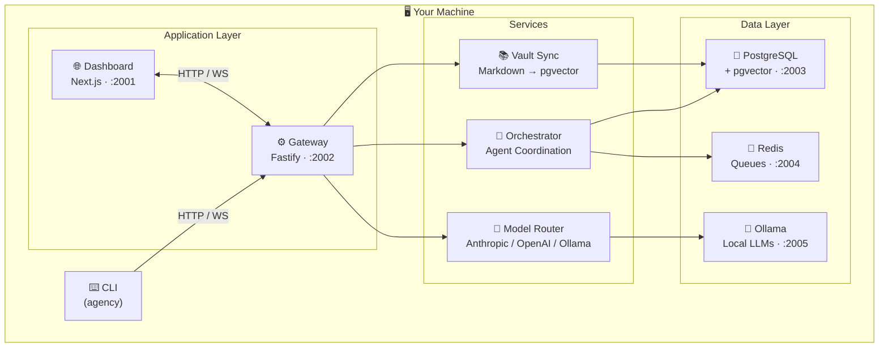

# 🤖 Agency

[](./LICENSE)
[](./CHANGELOG.md)
[](https://nodejs.org/)
[](https://docs.docker.com/engine/install/)
[](https://www.sinthetix.com)

**A self-hosted AI platform that runs entirely on your machine.**

Agency gives you a persistent, multi-agent AI assistant with a web dashboard, CLI, local model support, and a connected knowledge base — with no data leaving your system beyond your chosen AI providers.

> ⚠️ Pre-1.0 — early development. Expect rough edges.

---

## ✨ What is Agency?

Agency is a **personal AI operating system**. It runs a coordinated stack of services on your local machine: a core API gateway, a web dashboard, a multi-agent orchestrator, a model router that spans cloud and local models, and a knowledge base backed by PostgreSQL with pgvector for semantic search.

Your agents maintain **persistent memory** across all sessions — stored in PostgreSQL with vector embeddings for semantic retrieval, and mirrored to an [Obsidian](https://obsidian.md) vault at `~/.agency/vault/`. Obsidian is a free knowledge base app that gives you a beautiful visual interface for browsing your agent's brain — the default knowledge it ships with, the proposals your agents draft, and the canon notes you approve and build up over time. Chat through the web UI or terminal, route tasks to specialized agents, and review everything through a full audit log.

---

## 📸 Screenshots

> Screenshots coming soon. Install and see for yourself — `agency install` gets you running in minutes.

---

## 🧠 Features

| Feature | Description |
|---------|-------------|
| 🤝 **Multi-agent orchestration** | Main agent + specialized workers (Researcher, Coder, Writer). Coordinates on complex tasks with human-in-the-loop approvals. |
| 💾 **Persistent memory** | Conversations and knowledge stored in PostgreSQL with pgvector for semantic vector search. Context retrieved automatically across sessions. |
| 📚 **Structured knowledge base** | An [Obsidian](https://obsidian.md) vault at `~/.agency/vault/` synced in real-time to PostgreSQL. Open it in Obsidian to visually browse your agent's default brain, explore agent-drafted proposals, and review canon notes you've approved. Obsidian is free and optional — the vault is plain Markdown files that work in any editor. |
| 🦙 **Local model support** | Ollama runs in Docker. `qwen3:8b` pulled automatically on install. No cloud required. |
| 🔀 **Model routing** | Route tasks across Anthropic (Claude), OpenAI (GPT), and Ollama simultaneously. Per-tier routing with automatic fallbacks. |
| ⚡ **Real-time streaming** | WebSocket chat with live token streaming, tool call cards, and full session history. |
| 🛠️ **Skills & profiles** | Modular agent capabilities and swappable behavior profiles. Attach different toolsets without reconfiguring everything. |
| 🔌 **Connectors** | Discord integration. Talk to your agents from your existing chat apps. |
| 📬 **Redis queues** | Message queuing and pub/sub via Redis for async agent coordination and background tasks. |
| 🙋 **Human-in-the-loop** | Agents pause and request approval before executing sensitive operations. Full approval queue in the dashboard. |
| 📋 **Audit log** | Every agent action, tool call, and API request logged with full context. |

---

## 🏗️ Architecture



### Visual Overview

<p align="center">
  
</p>

### 📡 Services

| Port | Component | Role |
|------|-----------|------|
| **2001** | Dashboard | Web UI — chat, agents, vault, logs, approvals |
| **2002** | Gateway | Core API, WebSocket streaming, JWT auth, connectors |
| **2003** | PostgreSQL + pgvector | Persistent storage + semantic vector search |
| **2004** | Redis | Message queues, pub/sub, async task coordination |
| **2005** | Ollama | Local model inference (`qwen3:8b` included) |

> All services run on non-standard ports to avoid conflicts with existing local services.

---

## 🚀 Quick Start

### Prerequisites

- 🐧 Linux (Ubuntu, Debian, Fedora, Arch, and most modern distros)
- 🟢 [Node.js](https://nodejs.org/) >= 22
- 📦 [pnpm](https://pnpm.io/) >= 9: `npm install -g pnpm`
- 🐳 [Docker](https://docs.docker.com/engine/install/) with Docker Compose

### Install

```bash
git clone https://github.com/SinthetikIndustries/Agency.git
cd Agency/cli
npm install -g .
cd ..
agency install
```

The installer will:

1. 👤 Ask for your name and your main agent's name
2. 🔑 Ask for your AI API key (Anthropic or OpenAI)
3. 🐳 Start PostgreSQL, Redis, and Ollama in Docker
4. 🦙 Pull `qwen3:8b` into Ollama automatically
5. 🔨 Build the app
6. 🤖 Create default agents: main + Researcher, Coder, Writer
7. 📁 Set up an [Obsidian](https://obsidian.md) vault at `~/.agency/vault/` — open it in Obsidian to browse your agent's knowledge base, proposals, and canon notes visually

---

## 💻 Usage

```bash
agency start       # Start the gateway
agency stop        # Stop the gateway
agency status      # Check service health
agency restart     # Restart the gateway
```

Open the dashboard at **[http://localhost:2001](http://localhost:2001)** 🌐

---

## 🔄 Update

```bash
agency update
```

Pulls latest changes, rebuilds, and restarts automatically.

---

## 🗑️ Uninstall

```bash
agency uninstall
```

Removes all data and Docker volumes. Type `uninstall` to confirm. Then `npm uninstall -g agencycli` to remove the CLI.

---

## ⚙️ Configuration

| File | Purpose |
|------|---------|
| `~/.agency/config.json` | App settings (no secrets) |
| `~/.agency/credentials.json` | 🔐 API keys — never share |
| `~/.agency/vault/` | 📖 Obsidian vault — canon, proposals, notes, templates |
| `~/.agency/workspaces/` | Agent workspaces |

See `installation/config.example.json` for the full config schema.

---

## 📟 CLI Reference

```
agency install             🔧 First-time setup
agency start               ▶️  Start gateway
agency stop                ⏹️  Stop gateway
agency status              💚 Service health
agency doctor              🩺 Run diagnostics
agency update              🔄 Update to latest
agency uninstall           🗑️  Remove everything

agency agents list         📋 List agents
agency agents create -n Name
agency chat                💬 Chat in terminal
agency vault status        📚 Vault sync status
agency --help              📖 Full command list
```

---

## 🖥️ Dashboard Pages

Open at **[http://localhost:2001](http://localhost:2001)**

| Page | Description |
|------|-------------|
| 🏠 Overview | System health, active agents, recent activity |
| 💬 Chat | Real-time streaming chat with session history and tool call cards |
| 🤖 Agents | Agent list, profile switcher, workspace management |
| 🛠️ Skills | View and manage agent skills |
| 📚 Vault | Knowledge base status, sync controls, graph view |
| 🔌 Connectors | Discord integration management |
| 📋 Logs | Filterable service logs with JSON parsing |
| 🙋 Approvals | Human-in-the-loop approval queue |
| 🔍 Audit | Full audit log of all agent and API actions |
| ⚙️ Settings | Platform configuration |

---

## 🤖 Models

Agency supports **three providers simultaneously**:

| Provider | Models | Notes |
|----------|--------|-------|
| 🟠 **Anthropic** | Claude Sonnet, Haiku, Opus | Default provider |
| 🟢 **OpenAI** | GPT-4.1, GPT-4.1 mini | Optional |
| 🦙 **Ollama** | `qwen3:8b` + any Ollama model | Local inference in Docker — no cloud required |

The model router handles **per-tier routing**: configure a `cheap` model for lightweight tasks and a `strong` model for complex reasoning, with automatic fallbacks.

---

## 📊 Status

Pre-1.0. Core platform is functional. Active development.

- [x] ⚙️ Gateway + WebSocket streaming
- [x] 🤝 Multi-agent orchestration
- [x] 🔀 Model routing (Anthropic / OpenAI / Ollama)
- [x] 📚 Vault sync (Markdown → PostgreSQL + pgvector)
- [x] 🌐 Dashboard (10 pages)
- [x] 🔌 Discord connector
- [x] 🛠️ Skills + profiles
- [x] 📋 Audit log + approvals
- [ ] 📡 OpenTelemetry tracing
- [ ] 🔒 Full RBAC
- [ ] 🎉 1.0 release

---

## 🐛 Issues & Feedback

Found a bug or have a feature request? [Open an issue](https://github.com/SinthetikIndustries/Agency/issues) — we read everything.

Want to contribute? See [CONTRIBUTING.md](./CONTRIBUTING.md).

---

## ⭐ Star History

[](https://star-history.com/#SinthetikIndustries/Agency&Date)

---

## 🏢 About

Agency is developed and maintained by **[Sinthetix, LLC](https://www.sinthetix.com)**.

This software is source-available under the [Agency Source License 1.0](./LICENSE) — free for personal and non-commercial use. For commercial licensing, contact [sales@sinthetix.com](mailto:sales@sinthetix.com).
