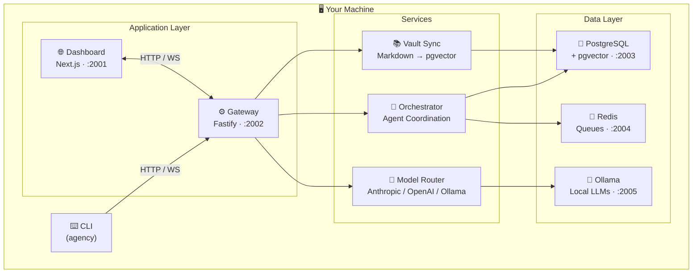

# 🤖 Agency

[](./LICENSE)
[](./CHANGELOG.md)
[](https://nodejs.org/)
[](https://docs.docker.com/engine/install/)
[](https://www.sinthetix.com)

**A self-hosted AI platform that runs entirely on your machine.**

Agency gives you a persistent, multi-agent AI assistant with a web dashboard, CLI, local model support, and a connected knowledge base — with no data leaving your system beyond your chosen AI providers.

> ⚠️ Pre-1.0 — early development. Expect rough edges.

---

## ✨ What is Agency?

Agency is a **personal AI operating system**. It runs a coordinated stack of services on your local machine: a core API gateway, a web dashboard, a multi-agent orchestrator, a model router that spans cloud and local models, and a knowledge base backed by PostgreSQL with pgvector for semantic search.

Your agents maintain **persistent memory** across all sessions — stored in PostgreSQL with vector embeddings for semantic retrieval, and mirrored to an [Obsidian](https://obsidian.md) vault at `~/.agency/vault/`. Obsidian is a free knowledge base app that gives you a beautiful visual interface for browsing your agent's brain — the default knowledge it ships with, the proposals your agents draft, and the canon notes you approve and build up over time. Chat through the web UI or terminal, route tasks to specialized agents, and review everything through a full audit log.

---

## 📸 Screenshots

> Screenshots coming soon. Install and see for yourself — `agency install` gets you running in minutes.

---

## 🧠 Features

| Feature | Description |
|---------|-------------|
| 🤝 **Multi-agent orchestration** | Orchestrator agent (system) + personal assistant (main) + any number of specialized sub-agents. Coordinator mode breaks complex tasks into phases with worker delegation. |
| 🔀 **Orchestrator / PA split** | Two protected built-in agents: the **Orchestrator** (full autonomy, system-level permissions) and **Main** (your personal assistant, human-approval gates). Each has its own workspace, memory, and permission profile. The Orchestrator's name and profile are locked — it automatically inherits every other agent's workspace as a secondary workspace when agents are created or removed. |
| 👥 **Workspace groups** | Organize agents into named groups with shared workspaces and shared memory. Agents in a group automatically see group-level context alongside their own. Every agent page shows a Group Workspaces card listing its groups. The Orchestrator sees all groups including the system-only **Agency System** group (its primary group workspace); other agents only see groups they belong to. |
| 🗺️ **Canvas views** | Interactive ReactFlow canvases throughout the dashboard: per-agent radial capability map (agent → skills, tools, workspaces), group topology canvas with drag-and-drop agent assignment, and a full-system Network map with live mode (auto-refresh every 5s). All canvases support edit mode, right-click context menus, a slide-in side panel, position persistence across sessions, and one-click layout reset. |
| 🤖 **Agent Architect** | Describe what you want an agent to do in plain language — Agency generates a complete agent spec (name, slug, system prompt, tools, permissions) using the LLM. One click to accept and create. |
| 🔐 **Per-agent permissions** | Fine-grained `AgencyPermissions` model: set `agentCreate`, `agentDelete`, `agentUpdate`, `groupCreate`, `groupUpdate`, `groupDelete`, and `shellRun` independently to `deny`, `request` (human approval), or `autonomous`. Plus per-agent allow/deny rule lists. |
| 💾 **Persistent memory** | Conversations and knowledge stored in PostgreSQL with pgvector for semantic vector search. Context retrieved automatically across sessions. Agents in a group share a group memory layer. |
| 📚 **Structured knowledge base** | An [Obsidian](https://obsidian.md) vault at `~/.agency/vault/` synced in real-time to PostgreSQL. Open it in Obsidian to visually browse your agent's default brain, explore agent-drafted proposals, and review canon notes you've approved. Obsidian is free and optional — the vault is plain Markdown files that work in any editor. |
| 🦙 **Local model support** | Ollama runs in Docker. `qwen3:8b` pulled automatically on install. No cloud required. |
| 🔀 **Model routing** | Route tasks across Anthropic (Claude), OpenAI (GPT), and Ollama simultaneously. Per-tier routing with automatic fallbacks. Prompt caching reduces API costs on repeated context. |
| ⚡ **Real-time streaming** | WebSocket chat with live token streaming, tool call cards, and full session history. Session search, prompt suggestions, and away-summary recaps when you return to an idle session. |
| 🛠️ **Skills & profiles** | Modular agent capabilities and swappable behavior profiles. Attach different toolsets without reconfiguring everything. |
| 🔧 **Tool registry** | Browse and manage the full set of agent tools by type: file, shell, browser, HTTP, code, memory, vault, messaging, and agent management. |
| 🪝 **Event hooks** | Register shell commands that fire on platform events — session created, agent woke, tool called, and more. Blocking hooks can intercept and gate events before they proceed. |
| 📬 **Messaging** | Structured inbound message queues per agent with priority, expiry, and delivery tracking. Agents send and receive typed messages. Monitor inbox depths and message history from the dashboard. |
| 🕐 **Scheduled tasks** | Cron-style job scheduling per agent. Configure recurring tasks from the dashboard or CLI, with run history and human-readable schedule descriptions. |
| 🔌 **MCP servers** | Connect to external MCP servers via stdio or HTTP/SSE. Tools from connected servers are automatically available to agents. Manage connections, trigger reconnects, and monitor status from the dashboard or CLI. |
| 🔌 **Connectors** | Discord integration. Talk to your agents from your existing chat apps. |
| 📬 **Redis queues** | Message queuing and pub/sub via Redis for async agent coordination and background tasks. |
| 🙋 **Smart approvals** | Agents pause before sensitive operations. A 2-stage permission classifier (heuristic + LLM) auto-blocks dangerous invocations and labels each approval LOW / MEDIUM / HIGH risk with an explanation and reasoning trace. |
| 🔍 **Adversarial verification** | Run an independent verification pass on completed work. The verifier tries to break the implementation — runs builds, tests, and adversarial probes — and returns a PASS / FAIL / PARTIAL verdict. |
| 🤖 **Proactive / autonomous mode** | Agents can run on a heartbeat loop, waking periodically to act on their own initiative. Focus-aware: collaborative when you're in the dashboard, fully autonomous when you're away. |
| 📋 **Audit log** | Every agent action, tool call, and API request logged with full context. |

---

## 🏗️ Architecture



### Visual Overview

<p align="center">
  
</p>

### 📡 Services

| Port | Component | Role |
|------|-----------|------|
| **2001** | Dashboard | Web UI — chat, agents, groups, network map, vault, logs, approvals |
| **2002** | Gateway | Core API, WebSocket streaming, JWT auth, connectors |
| **2003** | PostgreSQL + pgvector | Persistent storage + semantic vector search |
| **2004** | Redis | Message queues, pub/sub, async task coordination |
| **2005** | Ollama | Local model inference (`qwen3:8b` included) |

> All services run on non-standard ports to avoid conflicts with existing local services.

---

## 🚀 Quick Start

### Prerequisites

- 🐧 Linux (Ubuntu, Debian, Fedora, Arch, and most modern distros)
- 🟢 [Node.js](https://nodejs.org/) >= 22
- 📦 [pnpm](https://pnpm.io/) >= 9: `npm install -g pnpm`
- 🐳 [Docker](https://docs.docker.com/engine/install/) with Docker Compose

### Install

```bash
git clone https://github.com/SinthetikIndustries/Agency.git
cd Agency/cli
npm install
npm run build
npm install -g .
cd ..
agency install
```

The installer will:

1. 👤 Ask for your name and your main agent's name
2. 🔑 Ask for your AI API key (Anthropic or OpenAI)
3. 🐳 Start PostgreSQL, Redis, and Ollama in Docker
4. 🦙 Pull `qwen3:1.7b`, `qwen3:8b`, `nemotron-3-nano:4b`, and `gemma4:e4b` into Ollama automatically
5. 🔨 Build the app
6. 🤖 Create built-in agents: **Orchestrator** (system) + **Main** (personal assistant)
7. 📁 Set up an [Obsidian](https://obsidian.md) vault at `~/.agency/vault/` — open it in Obsidian to browse your agent's knowledge base, proposals, and canon notes visually
8. 🗂️ Create the **Agency System** group — the Orchestrator's primary group workspace, visible only to the Orchestrator

### Uninstall

```bash
agency uninstall
```

Type `uninstall` to confirm — removes all data and Docker volumes. Then remove the CLI:

```bash
npm uninstall -g agencycli
```

---

## 💻 Usage

```bash
agency start       # Start the gateway
agency stop        # Stop the gateway
agency status      # Check service health
agency restart     # Restart the gateway
```

Open the dashboard at **[http://localhost:2001](http://localhost:2001)** 🌐

---

## 🔄 Update

```bash
agency update
```

Pulls latest changes, rebuilds, and restarts automatically.

---

## ⚙️ Configuration

| File | Purpose |
|------|---------|
| `~/.agency/config.json` | App settings (no secrets) |
| `~/.agency/credentials.json` | 🔐 API keys — never share |
| `~/.agency/vault/` | 📖 Obsidian vault — canon, proposals, notes, templates |
| `~/.agency/workspaces/` | Agent workspaces |
| `~/.agency/shared/` | Shared group workspaces and memory |

See `installation/config.example.json` for the full config schema.

---

## 📟 CLI Reference

```
agency install             🔧 First-time setup
agency start               ▶️  Start gateway
agency stop                ⏹️  Stop gateway
agency status              💚 Service health
agency restart             🔄 Restart gateway
agency doctor              🩺 Run diagnostics
agency repair              🔨 Repair installation
agency update              ↑  Update to latest
agency uninstall           🗑️  Remove everything
agency metrics             📊 Prometheus metrics
agency health              🏥 Detailed health check

# Authentication
agency auth login          🔑 Log in with API key
agency auth logout         🚪 Log out
agency auth me             👤 Show current identity

# Configuration
agency config get <key>    📄 Get config value
agency config set <key>    ✏️  Set config value
agency config edit         📝 Open config in editor

# Agents
agency agents list         📋 List agents
agency agents create -n Name
agency agents show <slug>
agency agents update <slug>
agency agents enable <slug>
agency agents disable <slug>
agency agents model-config <slug>
agency agents profile list
agency agents profile attach <agent> <profile>
agency agents profile create
agency agents workspace get <slug>
agency agents workspace set <slug>

# Groups
agency groups list         👥 List workspace groups
agency groups create       Create a new group
agency groups members <id> List group members

# Sessions
agency sessions list       💬 List sessions
agency sessions info <id>
agency sessions messages <id>
agency sessions send <id> <message>
agency sessions pin <id>
agency sessions unpin <id>
agency sessions rename <id> <name>
agency sessions delete <id>

# Models
agency models list         🤖 List available models
agency models pull <model> Pull an Ollama model
agency models set-default <model>
agency models test <model> Send a test prompt

# Skills
agency skills list         🛠️  List skills
agency skills install <skill>
agency skills remove <skill>
agency skills update <skill>

# Vault
agency vault status        📚 Vault sync status
agency vault sync          Trigger manual sync
agency vault validate      Validate vault integrity
agency vault init          Initialize vault

# Schedules
agency schedules list      🕐 List scheduled tasks
agency schedules create    Create a scheduled task
agency schedules delete <id>
agency schedules enable <id>
agency schedules disable <id>
agency schedules runs <id>
agency schedules stats
agency schedules workers

# MCP Servers
agency mcp connections     🔌 List MCP connections
agency mcp reconnect <id>  Reconnect an MCP server

# Messaging
agency messaging status    📬 Messaging system status

# Queue
agency queue workers       ⚙️  Queue worker status

# Connectors
agency connectors list
agency connectors discord install
agency connectors discord enable
agency connectors discord disable

# Approvals
agency approvals list      🙋 Pending approvals
agency approvals approve <id>
agency approvals reject <id>

# Audit
agency audit list          📋 Audit log

# Logs
agency logs                View logs
agency logs service <name> Logs for a specific service

# Chat
agency chat                💬 Chat in terminal

agency --help              📖 Full command list
```

---

## 🖥️ Dashboard Pages

Open at **[http://localhost:2001](http://localhost:2001)**

| Page | Description |
|------|-------------|
| 🏠 Overview | System health, active agents, recent activity |
| 💬 Chat | Real-time streaming chat with session history, tool call cards, session search, prompt suggestions, and away-summary recaps |
| 🤖 Agents | Agent list, profile switcher, workspace management, per-agent canvas view, permission settings |
| 👥 Groups | Workspace group management — list view or canvas topology view |
| 🗺️ Network | Full-system canvas: orchestrator → groups → agents with live edges |
| 🛠️ Skills | View and manage agent skills |
| 🔧 Tools | Browse the full tool registry by type — file, shell, browser, HTTP, code, memory, vault, messaging, and agent management |
| 🪝 Hooks | Create and manage event hooks — shell commands that fire on platform events with blocking and non-blocking modes |
| 📚 Vault | Knowledge base status, sync controls, graph view |
| 📬 Messaging | Inter-agent message queues — inbox depths, recent messages, priority, and delivery status |
| 📋 Logs | Filterable service logs with JSON parsing |
| 🙋 Approvals | Human-in-the-loop approval queue with risk classification and reasoning traces |
| 🔍 Audit | Full audit log of all agent and API actions |
| 🕐 Schedules | Create and manage cron-style scheduled tasks per agent with run history |
| 🔌 MCP Servers | Add and manage MCP server connections (stdio and HTTP/SSE) |
| ⚙️ Settings | Platform configuration |

---

## 🤖 Models

Agency supports **three providers simultaneously**:

| Provider | Models | Notes |
|----------|--------|-------|
| 🟠 **Anthropic** | Claude Sonnet, Haiku, Opus | Default provider |
| 🟢 **OpenAI** | GPT-4.1, GPT-4.1 mini | Optional |
| 🦙 **Ollama** | `qwen3:1.7b`, `qwen3:8b`, `nemotron-3-nano:4b`, `gemma4:e4b` + any Ollama model | Local inference in Docker — no cloud required |

The model router handles **per-tier routing**: configure a `cheap` model for lightweight tasks and a `strong` model for complex reasoning, with automatic fallbacks.

---

## 📊 Status

Pre-1.0. Core platform is functional. Active development.

- [x] ⚙️ Gateway + WebSocket streaming
- [x] 🤝 Multi-agent orchestration + coordinator mode
- [x] 🔀 Orchestrator / PA split with protected built-in agents
- [x] 🔐 Per-agent `AgencyPermissions` (deny / request / autonomous per operation)
- [x] 👥 Workspace groups with shared workspaces and group memory
- [x] 🗺️ Canvas views (per-agent, group topology, full-system network map)
- [x] 🤖 Agent Architect — LLM-generated agent specs from plain-language descriptions
- [x] 🔀 Model routing (Anthropic / OpenAI / Ollama) + prompt caching
- [x] 📚 Vault sync (Markdown → PostgreSQL + pgvector)
- [x] 🌐 Dashboard (16 pages)
- [x] 🔧 Tool registry with typed tool browsing
- [x] 🪝 Event hooks (blocking and non-blocking)
- [x] 📬 Messaging system with typed queues and delivery tracking
- [x] 🕐 Scheduled tasks with cron scheduling and run history
- [x] 🔌 MCP server support (stdio + HTTP/SSE)
- [x] 🔌 Discord connector
- [x] 🛠️ Skills + profiles
- [x] 📋 Audit log + smart approvals with risk classification and reasoning trace
- [x] 💬 Session search, prompt suggestions, away summaries
- [x] 🔍 Adversarial verification gate
- [x] 🤖 Proactive / autonomous mode
- [ ] 📡 OpenTelemetry tracing
- [ ] 🔒 Full RBAC
- [ ] 🎉 1.0 release

---

## 🐛 Issues & Feedback

Found a bug or have a feature request? [Open an issue](https://github.com/SinthetikIndustries/Agency/issues) — we read everything.

Want to contribute? See [CONTRIBUTING.md](./CONTRIBUTING.md).

---

## ⭐ Star History

[](https://star-history.com/#SinthetikIndustries/Agency&Date)

---

## ☕ Support

If Agency is useful to you, consider buying me a coffee — or, you know, an Nvidia DGX Spark.

**CashApp: [$Sinthetix](https://cash.app/$Sinthetix)**

No pressure. Stars are free and also appreciated. ⭐

---

## 🏢 About

Agency is developed and maintained by **[Sinthetix, LLC](https://www.sinthetix.com)**.

This software is source-available under the [Agency Source License 1.0](./LICENSE) — free for personal and non-commercial use. For commercial licensing, contact [sales@sinthetix.com](mailto:sales@sinthetix.com).
